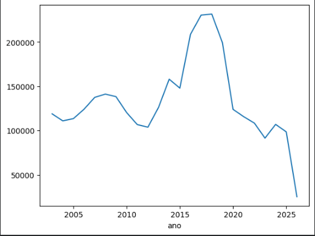
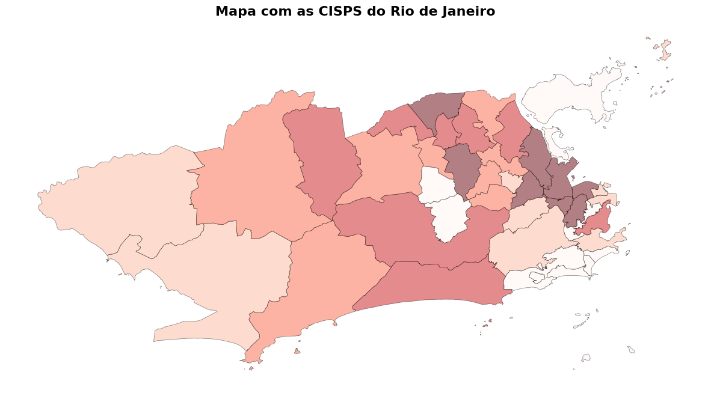
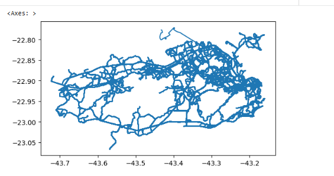
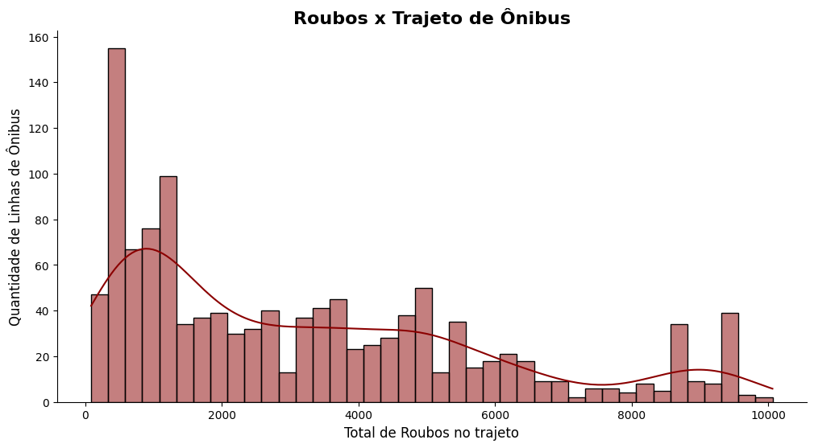
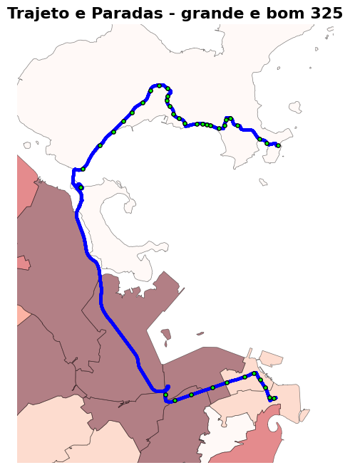

# Linhas por Roubos

## UFRJ Analytica 26.1

> Uma análise das linhas de ônibus mais seguras\
> *(e as mais perigosas)* da cidade do Rio de Janeiro

**Autores:** Rebecca Gomes Simão · Diogo dos Santos Machado Vieira ·
Pedro Henrique Ferrari\
**Rio de Janeiro --- Maio de 2026**

------------------------------------------------------------------------
- Link para demonstração: https://drive.google.com/file/d/1cYDN7p1GEvQrEgZH_UXzWaz6tMX-sEHz/view 

## Sumário

-   [1. Descrição](#1-descrição)
-   [2. Objetivos](#2-objetivos)
    -   [2.1 Objetivo Geral](#21-objetivo-geral)
    -   [2.2 Objetivos Específicos](#22-objetivos-específicos)
-   [3. Dados Utilizados](#3-dados-utilizados)
    -   [Coleta de Dados](#coleta-de-dados)
    -   [Caracterização dos Dados](#caracterização-dos-dados)
    -   [Período](#período)
    -   [Leitura](#leitura)
    -   [delegacia.csv](#delegaciacsv)
    -   [routes.csv](#routescsv)
    -   [trips.csv](#tripscsv)
    -   [shapes_geom.csv](#shapes_geomcsv)
-   [4. Métodos](#4-métodos)
    -   [4.1 Metodologia](#41-metodologia)
    -   [4.2 Técnicas e Algoritmos](#42-técnicas-e-algoritmos)
    -   [Mapa](#mapa)
    -   [Linhas](#linhas)
    -   [Relação](#relação)
    -   [Classificação de risco por
        intervalos](#classificação-de-risco-por-intervalos)
    -   [4.3 Ferramentas e Tecnologias](#43-ferramentas-e-tecnologias)
-   [5. Conclusão](#5-conclusão)
    -   [Principais resultados](#principais-resultados)
    -   [Insights obtidos](#insights-obtidos)
    -   [Limitações](#limitações)
    -   [Melhorias futuras](#melhorias-futuras)
    -   [Implementação de um modelo de Machine
        Learning](#implementação-de-um-modelo-de-machine-learning)
    -   [Utilização do arquivo stops.csv e
        stop_times.txt](#utilização-do-arquivo-stopscsv-e-stop_timestxt)
-   [6. Referências](#6-referências)

------------------------------------------------------------------------

# 1. Descrição

**Responsável pela seção:** Diogo dos Santos Machado Vieira

Este relatório apresenta uma visão geral do projeto/estudo realizado,
contextualizando o problema abordado, sua relevância e aplicação
prática.

A segurança pública no Rio de Janeiro constitui um dos principais
desafios enfrentados pela sociedade contemporânea, impactando
diretamente a qualidade de vida da população e o desenvolvimento social
e econômico da cidade. Marcado historicamente por desigualdades sociais,
crescimento urbano desordenado e disputas territoriais ligadas ao crime
organizado, o estado convive com elevados índices de violência que
afetam tanto moradores quanto visitantes. Nesse contexto, discutir a
segurança no Rio de Janeiro torna-se essencial para compreender as
dificuldades enfrentadas pelo poder público na garantia da ordem, da
proteção dos cidadãos e da promoção de políticas eficazes de combate à
criminalidade.

Diante disso, torna-se necessária a criação de iniciativas capazes de
contribuir para a redução da violência e para o fortalecimento da
sensação de segurança da população. A persistência desses problemas têm
como consequências, entre outras, a insegurança em espaços públicos e a
dificuldade do acesso à cidade. No livro *O Direito à Cidade*, de Henri
Lefebvre, ele define esse conceito, principalmente, como o direito de
todos os cidadãos de habitar e utilizar a cidade, isso inclui a
possibilidade de transporte dentro da cidade e o acesso aos seus
espaços.

Este trabalho, portanto, é uma proposta de auxílio à solução desse
problema do âmbito da segurança no Rio de Janeiro, tendo como foco a
segurança nos transportes públicos, mais especificamente nos trajetos e
linhas de ônibus. A ideia principal é que seja um sistema voltado para
profissionais da segurança pública, de forma a exibir informações úteis
que auxiliem na sua decisão estratégica.

Como o escopo do projeto está contido na relação entre ocorrências em
transporte público por área de divisão de segurança (nesse caso as
CISPs), a limitação do projeto reside na ideia que as ocorrências são
sempre registradas no local onde aconteceram e isso não é sempre
verdade, e no índice de segurança ser unicamente baseado nesses moldes,
sem levar préviamente em conta outras características do espaço físico
e/ou social do Rio de Janeiro.

### Figura 1 --- Mapa de calor com linhas de ônibus

------------------------------------------------------------------------

# 2. Objetivos

**Responsável pela seção:** Diogo dos Santos Machado Vieira

## 2.1 Objetivo Geral

O objetivo do projeto é desenvolver um sistema que disponibilize as
informações críticas de segurança. Essas informações baseadas nos moldes
do escopo do mesmo, serão exibidas no sistema de forma visual e de
simples entendimento para facilitar as decisões dos profissionais de
segurança pública.

## 2.2 Objetivos Específicos

Dentre as principais funcionalidades que se espera do sistema estão:

1.  **Mapa de calor** da cidade do Rio de Janeiro e entornos, para uma
    visualização rápida de áreas de maior necessidade de intervenção.

    ### Figura 2 --- Mapa de calor de CISPs x Ocorrências

    

2.  **Seleção/pesquisa de linhas e trajetos de ônibus**, para que as
    mesmas sejam exibidas no mapa com suas devidas estatísticas de
    segurança baseadas na relação entre os espaços percorridos e as
    ocorrências registradas em cada um deles.

    ### Figura 3 --- Linhas x Ocorrências

    

3.  **Panorama temporal dos dados** projetado no mapa, para visualização
    da influência dos períodos e anos no índice de segurança da cidade
    baseado na quantidade de ocorrências por ano.

    ### Figura 4 --- Tempo x Ocorrências

    

4.  **Comparativo entre informações** (risco, trajeto, quantidade de
    ocorrências) de diferentes linhas e sua exibição.

    ### Figura 5 --- Análise comparativa de linhas

    

------------------------------------------------------------------------

# 3. Dados Utilizados

**Responsável pela seção:** Rebecca Gomes Simão

## Coleta de Dados

A base de dados foi construída por dados de transporte do **SMTR
(Sistema Municipal de Transportes)** com o **ISP (Instituto de Segurança
Pública do RJ)**, fontes abertas e confiáveis mantidas pelo Governo e
Estado do Rio de Janeiro, e atualizadas recorrentemente, gerando uma
segurança para nossa análise de dados e futura geração de conclusões
vindas deles.

O objetivo era **cruzar as linhas de ônibus com as regiões da cidade do
Rio de Janeiro**, divididas em CISPs pelo Instituto de Segurança Pública
do RJ, as quais tinham os dados da quantidade de roubos em ônibus
naquela área que a CISP cobria. Dessa forma, tornava possível cruzar
essas informações **e obter o nível de Exposição a Roubo que um cidadão
carioca lidaria ao acessar uma determinada linha.**

Para tal, colhemos os seguintes Datasets:

-   **Sistema Municipal de Transportes**
    -   `routes.csv`
    -   `trips.csv`
-   **Instituto de Segurança Pública do RJ**
    -   `delegacias.csv`
    -   `shape_id.csv`
    -   `shape_geom.csv`
    -   `path_shape`

As etapas iniciais, como limpeza, exploração e *Feature Engineering*
foram desenvolvidas no Google Colab, pela facilidade de testagem e
velocidade, e posteriormente passadas para o **Python**, para criação do
protótipo no **Streamlit**.

## Caracterização dos Dados

### Período

Para a escolha do período da análise, observamos a média de roubos nos
períodos pré-pandemia, durante e pós, encontrando valores bem
destoantes:

> **Média pré-pandemia: 15507 \| Média pandemia: 8648 \| Média
> pós-pandemia: 5139**

Assim, optamos por nos mantermos nos dados mais atualizados, sendo de
2022 até a data presente, para que não tenhamos essas interferências.

### Leitura

Foi utilizado o parâmetro `usecols` na leitura dos arquivos CSV,
permitindo carregar apenas as colunas necessárias para a análise. Essa
estratégia reduziu significativamente o consumo de memória e melhorou o
desempenho do processamento.

Além disso, para o mesmo objetivo, foi realizada a **retirada das
duplicatas antes do cruzamento** das planilhas (com a função `merge`),
evitando cruzamento de linhas desnecessárias.

### `delegacia.csv`

  Informação               Valor
  -------------------- ---------
  **Tipos de dados**     `Int64`
  **Volume**              1.4 MB
  **Nulos**                    0
  **Duplicados**               0

**Colunas de interesse:**

-   Quantidade de roubos;
-   Ano e mês da ocorrência;
-   Número da CISP (territórios de atuação das delegacias de bairro,
    como a CISP 9, que corresponde a região do Flamengo);
-   Número da RISP (grandes regiões que agrupam várias CISPs).

### `routes.csv`

  Informação                 Valor
  -------------------- -----------
  **Tipos de dados**      `Object`
  **Volume**             872.9+ KB
  **Nulos**                      0
  **Duplicados**             35915
  **Rotas únicas**            1325

O número de duplicatas elevado é esperado, uma vez que na base original
há diversas variações que fazem com que as rotas únicas 1325 sejam
expandidas a mais variações não úteis dentro do nosso escopo. A mesma
quantidade, aliás, foi notada nas tabelas analisadas posteriormente.

**Colunas de interesse:**

-   `route_id`: usado para cruzar com a planilha `trips.csv`;
-   `route_short_name`: número do ônibus;
-   `route_long_name`: descrição do projeto, renomeado "descrição".

### `trips.csv`

  Informação                                   Valor
  --------------------------- ----------------------
  **Tipos de dados**            `Object` e `Float64`
  **Volume**                                21.2+ MB
  **Nulos `trip_headsign`**                      452
  **Nulos `direction_id`**                         9
  **Nulos `shape_id`**                             1
  **Duplicados**                               35915
  **Rotas únicas**                              1325

Os valores nulos de `trip_headsign` (nome da linha) foram preenchidos
com "Sem letreiro", enquanto os de `shape_id` e `direction_id` foram
apagados.

**Colunas de interesse:**

-   `route_id`: para cruzar com a `routes.csv`;
-   `trip_headsign`: nome da linha;
-   `direction_id`: para definir se ida ou volta, sendo 0, ida, e 1,
    volta;
-   `shape_id`: para conseguir a rota das linhas;
-   `trip_id`: seria utilizado para cruzar com `stop_times` (entrega
    sequência de pontos de parada do ônibus).

### `shapes_geom.csv`

  Informação                 Valor
  -------------------- -----------
  **Tipos de dados**      `object`
  **Volume**             218.0+ KB
  **Nulos**                      0
  **Duplicados**             35915
  **Rotas únicas**            1325

**Colunas de interesse:**

-   `shape_id`: para cruzar com os dados de `trips` e `routes`;
-   `shape`: informações das coordenadas das linhas, conseguindo ser
    traduzidas para informações de GPS para plotagem das linhas.

------------------------------------------------------------------------

# 4. Métodos

**Responsáveis pela seção:**

-   Rebecca Gomes Simão
-   Pedro Henrique Ferrari Nascimento

## 4.1 Metodologia

Após a coleta e limpeza dos dados, os trajetos únicos foram isolados
para se tornarem linhas de rotas plotáveis em gráfico, com informações
agregadas de cada coletivo. Além disso, utilizando os dados de shape
oriundos da ISP, foi possível plotar o mapa do Rio de Janeiro dividido
por regiões. Dessa forma, o próximo passo foi o cálculo de exposição a
risco de roubo.

## 4.2 Técnicas e Algoritmos

### Modelos utilizados

-   **Agregação por CISP:** Filtramos os dados por ano, mês e RISP, e
    depois somamos os roubos por CISP. Assim, conseguimos saber quantos
    roubos ocorreram em cada CISP e, consequentemente, alimentar o mapa
    do calor que foi implementado na interface.

-   **Cruzamento entre linhas e CISPs:** usando o `gpd.sjoin`, foi feita
    uma junção espacial entre os trajetos de linhas de ônibus e áreas de
    CISPs. Os trajetos de linhas de ônibus são representados como
    `LineString`, enquanto as CISPs são representadas como polígonos.
    Sendo assim, combinando esse cruzamento com dados de roubo por CISP,
    conseguimos construir uma visualização geográfica ao longo dos
    trajetos.

-   **Modelo de exposição ao risco por CISP:** após descobrir por quais
    CISPs cada linha passa, conseguimos obter uma métrica chamada
    `exposicao_roubo_total`, que é calculada pela soma dos roubos
    registrados nas CISPs atravessadas pela linha.

-   **Comparativo entre duas linhas de ônibus:** criamos uma aba para
    comparar duas linhas de ônibus, com possibilidade de escolher entre
    ida, volta ou ambos os sentidos, e comparar o risco associado a cada
    linha.

### Mapa

A Divisão Territorial de Segurança Pública, também fornecida pelo ISP,
possui arquivo de Bases cartográficas com as coordenadas necessárias
(polígonos) para se desenhar as áreas cobertas de cada delegacia, que,
cruzadas com tabela de crimes ordenados, resultam na cidade do Rio de
Janeiro.

Assim, no Colab, utilizando as bibliotecas de **GeoPandas** para
conseguir converter os polígonos em coordenadas entendíveis,
**Matplotlib**, para plotar o gráfico com as separações de cada região e
**Mapclassify**, para produzir um mapa de calor que fica mais vermelho
conforme maior exposição ao risco, o resultado é o mapa abaixo:

### Linhas

As linhas de ônibus foram desenhadas utilizando a planilha
`shapes_geom.csv`. Inicialmente são filtrados os `shapes_id` apenas das
linhas de ônibus que serão analisadas (`locomoção_sem_duplicata`) e são
cruzados dos datasets com as informações de cada linha e da localização
geográfica em que elas passam.

Feito isso, converte-se a informação presente na coluna `geometry` (um
linestring com coordenadas em formato de texto) e são transformadas em
uma linha geométrica matemática, possível de ser compreendida como
coordenadas geográficas, utilizando o padrão `EPSG:4326`, de GPS.

### Relação

As linhas e o mapa são cruzados usando interseção (se a linha de ônibus
passar por 10 delegacias, a tabela terá 10 colunas, uma com cada
delegacia e a respectiva quantidade de roubos que ocorreram na região).
Feito isso, agrupamos os roubos de cada delegacia tornando um valor
único, para gerar a exposição ao roubo da linha em específico.

### Classificação de risco por intervalos

Inicialmente pensamos em utilizar classificação feita pelo `pd.qcut`,
dividindo por nota a cada 10% (ou seja, primeiros 10%, nota 1, após,
nota 2 e assim por diante). A técnica, no entanto, não se mostrou
eficaz, classificando rotas seguras com risco alto por ter mais rotas
com pouco roubo.

Para validar o problema, foi plotado o gráfico do ônibus 325, que
aparecia com nota 10, embora seu trajeto passasse por pelo menos 2 CISPs
de risco baixo --- como notado no mapa de calor. Analisando o
histograma, é possível perceber que a maior parte dos ônibus têm notas
baixas. Assim, a divisão dos `.qcut()` inerentemente resultaria em uma
má classificação, pois avalia densidade.

Pensamos então em analisar intervalos, dividindo a nota em 5 partes
iguais que variam conforme quantidade de roubos por linha. A tabela
acima tem a relação de quantidade de ônibus por nota recebida.

**Hiperparâmetros principais:** Como não usamos nenhum modelo de Machine
Learning, o que temos são parâmetros básicos.

## 4.3 Ferramentas e Tecnologias

### Linguagem

-   **Python** foi a linguagem principal utilizada para todo o
    desenvolvimento, desde o processamento de dados até a criação da
    interface com **Streamlit** utilizando versionamento com **Git** e
    com auxílio do **Live Share**.

### Bibliotecas

-   **Pandas:** Manipulação de dados tabulares, leituras de arquivos CSV
    e Parquet, além de agregações.
-   **GeoPandas:** Utilizada para análise geoespacial, permitindo a
    leitura de shapefiles e operação de spatial joins entre linhas
    (trajetos) e polígonos (CISPs).
-   **Streamlit:** Biblioteca utilizada para construir a interface web
    interativa.
-   **Folium & Streamlit-Folium:** Renderização dos mapas interativos,
    criação da camada calor e exibir os trajetos de ônibus no navegador.
    Substituímos o **Matplotlib** pelo Folium, no protótipo final,
    devido a sua interatividade com o usuário.
-   **Shapely (função WKT):** Conversão de strings de geometria do
    arquivo shapes para objetos geográficos que o Python consegue
    processar.

### Infraestrutura

-   **Streamlit Framework:** Foi usado para criar a interface web
    interativa, com exibição de mapas, filtros para o usuário, etc.
-   **Armazenamento Local:** Os dados são consumidos a partir de
    arquivos CSV e Parquet (formato utilizado para reduzir o tamanho de
    alguns arquivos e acelerar as operações), de forma local.

------------------------------------------------------------------------

# 5. Conclusão

**Responsáveis pela seção:**

-   Pedro Henrique Ferrari
-   Rebecca Gomes Simão

## Principais resultados

O projeto resultou na criação de uma interface de geoprocessamento que
integra dados de segurança pública do ISP com dados de mobilidade urbana
do SMT. Assim, conseguimos mapear a concentração de roubos em coletivo
por CISP, atribuir uma nota de risco a cada linha específica e comparar
duas rotas de ônibus para obter insights.

## Insights obtidos

-   Foi observado uma drástica redução no número de roubos a coletivos
    no período pós pandemia (após 2020).
-   Algumas CISPs são extremamente seguras, enquanto outras são têm
    números altíssimos de roubos registrados. Isso mostra uma grande
    disparidade entre regiões.
-   O `pd.qcut` não se mostrou eficaz, classificando rotas seguras com
    risco alto por ter mais rotas com pouco roubo. Preferimos manter o
    grupo equilibrado.

## Limitações

-   A principal limitação da nossa análise encontra-se no fato de que o
    modelo pressupõe que os crimes são registrados na exata CISP onde
    ocorreram. Isso não é 100% verdade, pois caso um roubo aconteça em
    um transporte público, a vítima pode registrar o roubo apenas na
    delegacia do seu destino.
-   A agregação em nível de CISP generaliza o risco para toda a região,
    ou seja, não é possível saber em qual rua ou bairro o crime ocorreu.
    Isso acontece pois cada CISP contém diversas delegacias.
-   As paradas de cada linha de ônibus deveriam ser analisadas e
    utilizadas no cálculo do risco. Uma linha que passa por uma CISP com
    7 paradas é relativamente mais perigosa do que uma linha que passa
    por 3 paradas, uma vez que a parada é uma peça chave para que o
    roubo aconteça. Sendo assim, seria interessante incluir o número de
    paradas no cálculo do risco por linha.
-   Nosso projeto também considera o dataset disponibilizado no site do
    Instituto de Segurança Pública do Rio de Janeiro, mas não
    conseguimos uma API para obter dados em tempo real. Infelizmente,
    por exemplo, só temos acesso a dados até Março de 2026. Tentamos
    entrar em contato com um comissário da polícia civil pelo Instagram,
    visto que ela posta diversos vídeos falando sobre análises de
    segurança pública com informações mais detalhadas, como dia da
    semana, rua e horário, mas não obtivemos resposta. Seria muito
    interessante ter acesso a essas informações.

## Melhorias futuras

-   Maior detalhamento dos roubos, caso tivéssemos acesso a dados um
    pouco mais minuciosos, como faixa de horário do crime e dia da
    semana.
-   Utilizar dados do arquivo `stops.parquet` para identificar os pontos
    de parada de uma linha de ônibus, a fim de determinar um risco mais
    preciso.
-   Implementação de um modelo de Machine Learning para prever algum
    target, por exemplo, baseado nas informações que temos.

## Implementação de um modelo de Machine Learning

## Utilização do arquivo `stops.csv` e `stop_times.txt`

A utilização das informações de pontos de ônibus, ao invés de
exclusivamente linha, é relevante para análise futura. A ideia foi
iniciada no Colab, porém não implementada no protótipo final.

Foi pensado na implementação das seguintes funcionalidades:

1.  **Aumento de nota de risco em linhas que tem mais paradas em regiões
    perigosas:** uma linha que tem uma parada em uma CISP com muito
    roubo está menos exposta a sofrer com esse problema do que uma linha
    que possui 3 paradas, então cruzar essa informações agregaria na
    melhoria da classificação.

2.  **Classificação de risco por trajeto personalizável:** um cidadão
    que pega o 325 --- exemplo acima para melhor visualização --- do
    Fundão até a Ilha do Governador é menos exposto ao risco do que um
    que pega no Centro. Assim, essa separação permitiria também uma
    melhoria significativa na classificação.

3.  **Integração de linhas:** tendo o ponto de partida e chegada
    desejado do usuário, é possível escalar o projeto mostrando o nível
    de risco associado de diferentes combinações de ônibus.

------------------------------------------------------------------------

# 6. Referências

- **Secretaria Municipal de Transportes — SMTR.** [Secretaria Municipal de Transportes](https://transportes.prefeitura.rio/).
- **Dados Abertos — Instituto de Segurança Pública.** [ISP Dados](https://www.ispdados.rj.gov.br/).
- **Pandas.** [pandas documentation](https://pandas.pydata.org/docs/).
- **GeoPandas.** [GeoPandas documentation](https://geopandas.org/).
- **Streamlit.** [Streamlit](https://streamlit.io/).
- **Folium.** [Folium documentation](https://python-visualization.github.io/folium/).
- **randyzwitch/streamlit-folium.** [GitHub repository](https://github.com/randyzwitch/streamlit-folium).
- **Shapely.** [Shapely documentation](https://shapely.readthedocs.io/).
